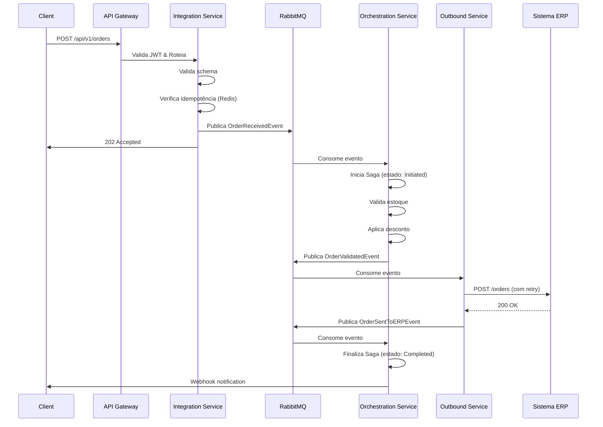

# 🏗️ Proposta de Arquitetura - Sistema de Integração e Orquestração

> **Desafio TechLead .NET Senior** - Hub de integração baseado em microserviços com alta disponibilidade, observabilidade e escalabilidade horizontal.

---

## 📌 Contexto do Desafio

Propor uma arquitetura para um sistema que atua como **hub de integração** entre sistemas terceiros, realizando:

- ✅ Recebimento de requisições externas (via APIs ou mensagens)
- ✅ Processamento interno com regras de negócio
- ✅ Envio de dados para outros sistemas
- ✅ Gerenciamento de estados e workflow das requisições

Com garantias de **resiliência, rastreabilidade, observabilidade e escalabilidade**.

---

## 🎯 Visão Geral da Solução

A arquitetura proposta implementa um **hub de integração baseado em microserviços**, utilizando o ecossistema **.NET 8+** com padrões modernos de desenvolvimento distribuído.

### Princípios Arquiteturais

- **Event-Driven Architecture** - Comunicação assíncrona desacoplada
- **CQRS + Event Sourcing** - Separação de leitura/escrita com auditoria completa
- **API Gateway Pattern** - Ponto único de entrada com roteamento inteligente
- **Circuit Breaker & Retry** - Resiliência em comunicações externas
- **Saga Pattern** - Orquestração de workflows complexos com compensações
- **Idempotência** - Garantia de processamento único por requisição

---

## 🏛️ Diagrama de Arquitetura

---

## 🛠️ Stack Tecnológica

### Core Framework
- **[.NET 8+](https://dotnet.microsoft.com/)** - Runtime LTS com performance otimizada
- **[ASP.NET Core](https://docs.microsoft.com/aspnet/core)** - Framework para APIs RESTful
- **[Entity Framework Core](https://docs.microsoft.com/ef/core/)** - ORM para persistência

### Mensageria & Orquestração
- **[MassTransit](https://masstransit.io/)** - Abstração para mensageria com Saga Pattern
- **[RabbitMQ](https://www.rabbitmq.com/)** - Message broker com clustering
- **Azure Service Bus** - Alternativa cloud-native

### Persistência
- **[PostgreSQL](https://www.postgresql.org/)** - Write model (CQRS) com transações ACID
- **[MongoDB](https://www.mongodb.com/)** - Read model desnormalizado
- **[Redis](https://redis.io/)** - Cache distribuído e controle de idempotência

### Resiliência
- **[Polly](https://github.com/App-vNext/Polly)** - Retry, Circuit Breaker, Timeout
- **[YARP](https://microsoft.github.io/reverse-proxy/)** - API Gateway de alta performance

### Observabilidade
- **[Serilog](https://serilog.net/)** - Logging estruturado com enrichers
- **[OpenTelemetry](https://opentelemetry.io/)** - Traces, métricas e logs unificados
- **[Prometheus](https://prometheus.io/)** - Coleta de métricas
- **[Grafana](https://grafana.com/)** - Visualização e dashboards
- **[Jaeger](https://www.jaegertracing.io/)** - Distributed tracing
- **[Seq](https://datalust.co/seq)** / **[Elasticsearch](https://www.elastic.co/)** - Agregação de logs

### Infraestrutura
- **[Docker](https://www.docker.com/)** - Containerização
- **[Kubernetes](https://kubernetes.io/)** - Orquestração e autoscaling
- **[Azure Key Vault](https://azure.microsoft.com/services/key-vault/)** - Gerenciamento de secrets

---

## 📦 Componentes da Arquitetura

### 1️⃣ API Gateway (YARP)
**Responsabilidades:**
- Roteamento de requisições para microserviços
- Autenticação/Autorização centralizada (JWT + OAuth 2.0)
- Rate limiting (100 req/min por IP)
- Correlação de requisições (correlation-id)
- Circuit breaking para serviços downstream

### 2️⃣ Integration Service
**Responsabilidades:**
- Receber requisições externas via REST/gRPC
- Validar payloads (FluentValidation)
- Publicar eventos no message broker
- Implementar idempotência (Redis)
- Registrar eventos no Event Store

**Padrões:** Mediator (MediatR), Repository, Unit of Work

### 3️⃣ Orchestration Service
**Responsabilidades:**
- Consumir eventos de integração
- Executar regras de negócio complexas
- Orquestrar workflows (Saga Pattern)
- Gerenciar estados de transação distribuída
- Aplicar compensações em falhas

**Padrões:** Saga Pattern, State Machine, Outbox Pattern

### 4️⃣ Outbound Service
**Responsabilidades:**
- Consumir eventos de saída
- Integrar com APIs terceiras
- Retry com backoff exponencial (Polly)
- Circuit breaker para isolamento de falhas
- Dead Letter Queue (DLQ) para falhas permanentes

---

## 🎯 Requisitos Não-Funcionais Atendidos

### 🔒 Alta Disponibilidade (99.9% SLA)
- ✅ Kubernetes ReplicaSets (mínimo 3 pods)
- ✅ Health checks (liveness/readiness probes)
- ✅ Graceful shutdown (SIGTERM handling)
- ✅ Rolling updates sem downtime

### 🛡️ Tolerância a Falhas
- ✅ Circuit breaker (Polly - threshold 50% falhas/10s)
- ✅ Retry com backoff exponencial (1s → 16s)
- ✅ Timeout policies (30s sync, 5min async)
- ✅ Bulkhead isolation (thread pools separados)

### 📊 Observabilidade
- ✅ **Logs estruturados** (JSON com correlation-id)
- ✅ **Métricas RED** (Rate, Errors, Duration)
- ✅ **Distributed tracing** (W3C Trace Context)
- ✅ **Alerting** (Prometheus AlertManager → Slack/PagerDuty)

### ⚡ Escalabilidade Horizontal
- ✅ Kubernetes HPA (target 70% CPU)
- ✅ KEDA (event-driven autoscaling)
- ✅ Stateless services (estado em Redis/DB)
- ✅ Connection pooling otimizado

### 🔐 Segurança
- ✅ OAuth 2.0 + JWT (Identity Server)
- ✅ TLS 1.3 (Let's Encrypt)
- ✅ Azure Key Vault (secrets)
- ✅ Rate limiting e input validation
- ✅ OWASP security headers

### 🔍 Rastreabilidade
- ✅ Correlation ID em toda a stack
- ✅ Event Sourcing (histórico completo)
- ✅ Audit trail de integrações
- ✅ Retention de 90 dias (online) + 7 anos (archive)

---

## 🚀 Exemplo de Fluxo Completo

**Cenário:** Integração de Pedido de E-commerce

**Rastreamento:**
- ✅ Correlation ID: `abc-123-xyz`
- ✅ Timeline: 220ms total (Gateway 5ms → Integration 40ms → Orchestration 120ms → Outbound 55ms)
- ✅ Métricas: 450 req/min, 0.02% error rate, p99 380ms

---

## 📈 Métricas de Sucesso (KPIs)

| Categoria | Métrica | Target |
|-----------|---------|--------|
| **Disponibilidade** | Uptime | 99.9% (SLA) |
| **Performance** | Latência P99 | < 500ms |
| **Performance** | Throughput | > 1000 req/s |
| **Confiabilidade** | Taxa de Erro | < 0.1% |
| **Escalabilidade** | Tempo de Scale-up | < 2 minutos |
| **Observabilidade** | MTTR | < 30 minutos |
| **Observabilidade** | MTTD | < 5 minutos |
| **Segurança** | Vulnerabilidades Críticas | 0 (zero tolerance) |
| **Qualidade** | Code Coverage | > 80% |
| **Deploy** | Deployment Frequency | Múltiplos/dia |

---

## ⚠️ Riscos e Mitigações

### 🔴 Complexidade de Debugging Distribuído
**Impacto:** Dificuldade em rastrear falhas cross-service  
**Mitigação:** Distributed tracing obrigatório (Jaeger), correlation IDs, dashboards centralizados

### 🟡 Consistência Eventual
**Impacto:** Dados temporariamente inconsistentes  
**Mitigação:** Design de UX considerando eventual consistency, timeouts claros

### 🔴 Message Broker como SPOF
**Impacto:** Falha no broker paralisa o sistema  
**Mitigação:** Clustering RabbitMQ (3+ nodes), filas duráveis, monitoramento 24/7

### 🟡 Poison Messages
**Impacto:** Mensagens inválidas bloqueiam consumidores  
**Mitigação:** Validação rigorosa, DLQ, max retry (5x), alertas automáticos

### 🟠 Custo Operacional
**Impacto:** Infraestrutura distribuída mais cara  
**Mitigação:** Right-sizing, autoscaling, spot instances, monitoramento de custos

---

## 🗺️ Roadmap de Implementação

### **Fase 1: Fundação** (Mês 1-2)
- [ ] Setup de infraestrutura (K8s, PostgreSQL, Redis)
- [ ] Implementação do API Gateway
- [ ] Integration Service MVP
- [ ] Observabilidade básica (Serilog + Seq)
- [ ] CI/CD pipeline

### **Fase 2: Orquestração** (Mês 3-4)
- [ ] Message Broker (RabbitMQ)
- [ ] Orchestration Service (MassTransit)
- [ ] CQRS + Event Sourcing
- [ ] Saga Pattern
- [ ] Outbound Service (Polly)

### **Fase 3: Resiliência** (Mês 5)
- [ ] Circuit breaker e retry refinados
- [ ] Dead letter queues e alerting
- [ ] Health checks e graceful shutdown
- [ ] Chaos engineering

### **Fase 4: Observabilidade Avançada** (Mês 6)
- [ ] Distributed tracing (Jaeger)
- [ ] Prometheus + Grafana dashboards
- [ ] AlertManager configurado
- [ ] SLOs e error budgets

### **Fase 5: Otimização e Escala** (Mês 7-8)
- [ ] Performance tuning
- [ ] Autoscaling (HPA + KEDA)
- [ ] Caching strategy
- [ ] Load testing

---

## 📚 Referências Técnicas

- [Microsoft .NET Architecture Guides](https://dotnet.microsoft.com/learn/dotnet/architecture-guides)
- [MassTransit Documentation](https://masstransit.io/documentation)
- [Polly Resilience Patterns](https://github.com/App-vNext/Polly)
- [OpenTelemetry .NET](https://opentelemetry.io/docs/languages/net/)
- [Kubernetes Best Practices](https://kubernetes.io/docs/concepts/)
- Martin Fowler - "Enterprise Patterns" (CQRS, Event Sourcing)
- Eric Evans - "Domain-Driven Design"
- Sam Newman - "Building Microservices" 2nd Edition

---

## 📄 Documentação Completa

Para acessar a proposta completa em formato PDF com todos os detalhes técnicos, diagramas e análises na pasta `docs`, clique no link abaixo:

👉 **[Download Proposta Completa (PDF)](./doc/proposta-arquitetura.pdf)**

---

## 👨‍💻 Autor

**Carmino Eduardo Vellutto**  
TechLead .NET Senior Candidate

- 📧 Email: eduardo.vellutto@gmail.com
- 💼 LinkedIn: [linkedin.com/in/carmino-eduardo-vellutto](https://linkedin.com/in/carmino-eduardo-vellutto)
- 🐙 GitHub: [@eduardovellutto](https://github.com/eduardovellutto)

---

  
<strong>Desenvolvido com ❤️ para o desafio TechLead .NET Senior</strong>

  
Outubro 2025

